# Project 3 / Scene recognition with bag of words
## 102062171 (洪章瑋)
### Overview
In this project, I created a scene recognition system and experiemented a lot of techniques such as tiny image, bag of word ... etc.
This project is consist of two parts, feature encoding and classfier. In feature encoding part, I experiemented tiny image, bag of visual words, bag of words with gaussian pyramid, bag of words combined with gist feature and fisher vector. In feature classifer part, I experimented k-NN and 1-vs-all SVM classfier and linear kernel, radial basis function kernel, polynomial kernel SVM. The best accuracy is 0.779 (with bag of words with gaussian pyramid + linear kernel SVM).
### Implementation
- Feature extraction
  - Tiny image (get_tiny_images.m)
    1. Resize the image to the same size
    2. Subtract image mean (zero mean)
    3. Normalize the image
  - Bag of word (SIFT) (build_vocabulary.m, get_bags_of_sifts.m)
    1. Extract same amout of SIFT features from all images in the training set
    2. Cluster all SIFT features into m class (e.g. 400, 800...) to build a vocabulary
    3. Extract SIFT features from training, testing set
    4. Calculate each histogram according to vocabulary which created in Step 2
  - Bag of word (SIFT + GIST) (build_vocabulary_gist_sift.m, get_bags_of_sift_gist.m)
    1. Extract same amout of SIFT features from all images in the training set
    2. Cluster all SIFT features into m class (e.g. 400, 800...) to build a vocabulary
    3. Extract SIFT features from training, testing set
    4. Calculate each histogram according to vocabulary which created in Step 2
    5. Append GIST feature to each image's histogram
  - Bag of word (SIFT + Gaussian pyramid) (build_vocabulary.m, get_bags_of_spatial_sifts.m)
    1. Extract same amout of SIFT features from all images in the training set
    2. Cluster all SIFT features into m class (e.g. 400, 800...) to build a vocabulary
    3. Extract SIFT features from training, testing set in different scale (Level 1 ~ 3)
    4. Calculate each histogram in grid according to vocabulary which created in Step 2
        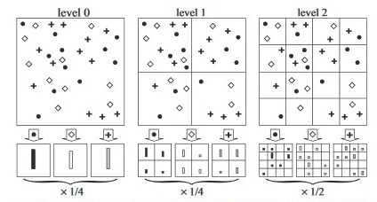
  - Bag of word (Fisher vector) (get_bags_of_sifts_fisher.m)
    1. Extract same amout of SIFT features from all images in the training set
    2. Calculate GMM model to get [means, covariance, priors]
    3. Extract SIFT features from training, testing set
    4. Calculate fisher vector from SIFT features
- Classfier
  - k-NN (nearest_neighbor_classify.m)
    1. Use 'knnsearch' to search the nearest vector (with Euclidean distance)
  - 1-vs-all SVM (svm_classify.m)
    1. Train SVM model on every category with training features
    2. Calculate confidence value (W * testing features + B)
    3. Choose max confidence class
  - Kernel SVM (svm_kernel_rbf_classify.m)
    1. Use libSVM to train different model under different kernel
      - Linear
        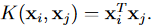
      - Radial basis function
        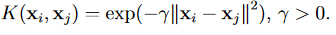
      - Polynomial
        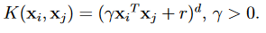
      - Sigmoid
        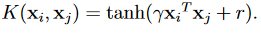
    
### How to run
1. In matlab enter "run('vlfeat-0.9.20-bin\vlfeat-0.9.20\toolbox\vl_setup.m')"
2. In matlab enter "addpath(libsvm/matlab)"
3. run proj3.m
4. modify parameters (e.g. FEATURE, CLASSFIER) in proj3.m 

### Results
- Tiny image + nearest neighbor
  - Accuracy = 0.222
  

- Bag of word(SIFT) + nearest neighbor (voc size = 400)
  - Accuracy = 0.222
  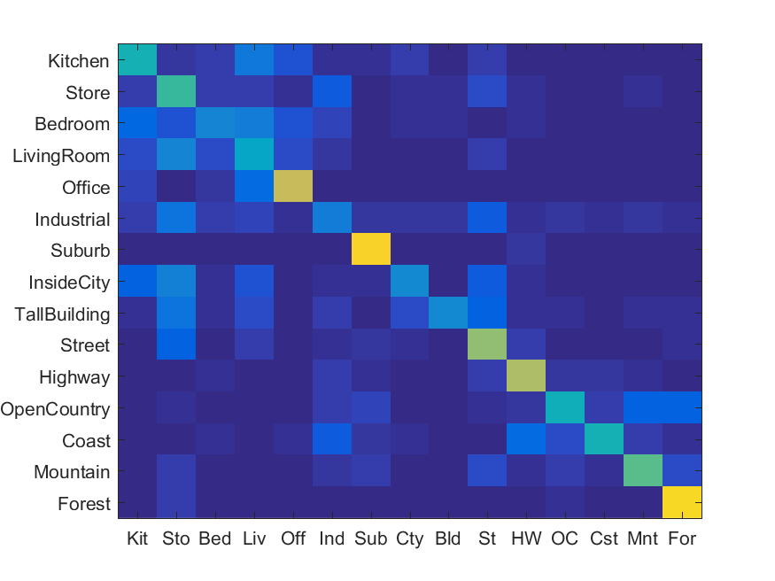
  
- Bag of word(SIFT) + 1-vs-all SVM (voc size = 400)
  - Accuracy = 0.639
  
- Bag of word(SIFT + GIST) + 1-vs-all SVM (voc size = 400)
  - Accuracy = 0.651
  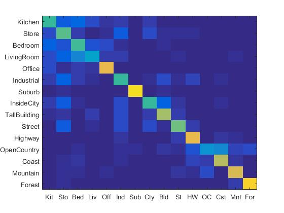
  
- Bag of word(SIFT and Gaussian pyramid L=3) + 1-vs-all SVM (voc size = 400)
  - Accuracy = 0.758
  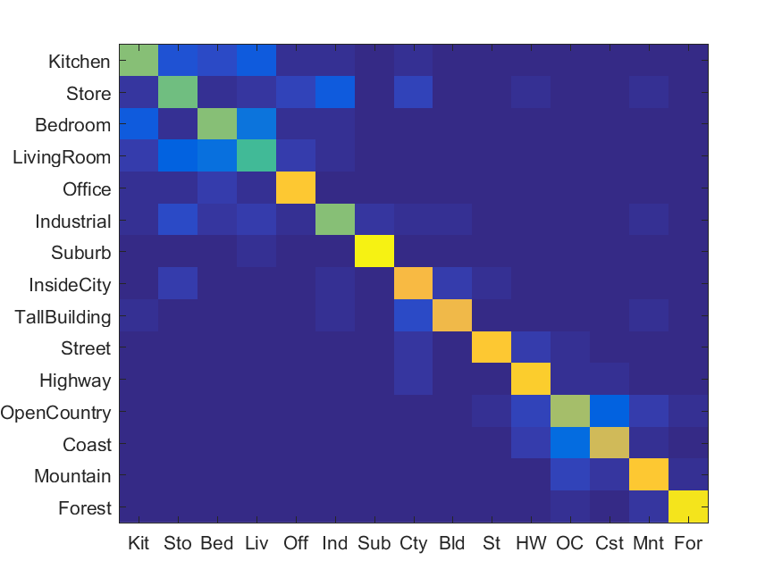
  
- Bag of word(SIFT and Gaussian pyramid L=3) + Linear SVM (voc size = 400)
  - Accuracy = 0.779
  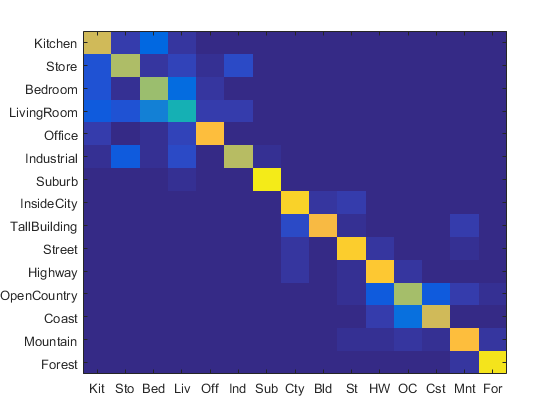
  
- Bag of word(SIFT and Gaussian pyramid L=3) + RBF SVM (voc size = 400)
  - Accuracy = 0.483
  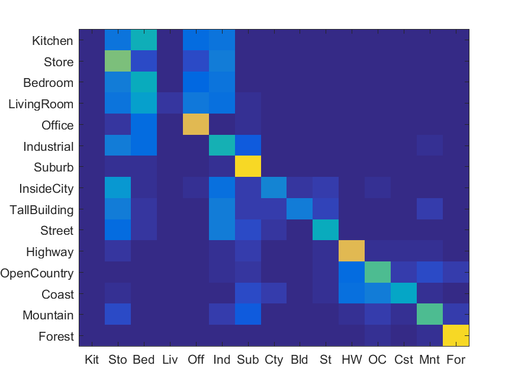
  
- Bag of word(SIFT and Gaussian pyramid L=3) + Polynomial SVM (voc size = 400)
  - Accuracy = 0.489
  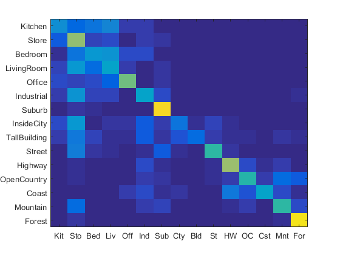
  
- Bag of word(SIFT and Gaussian pyramid L=3) + Sigmoid SVM (voc size = 400)
  - Accuracy = 0.378
  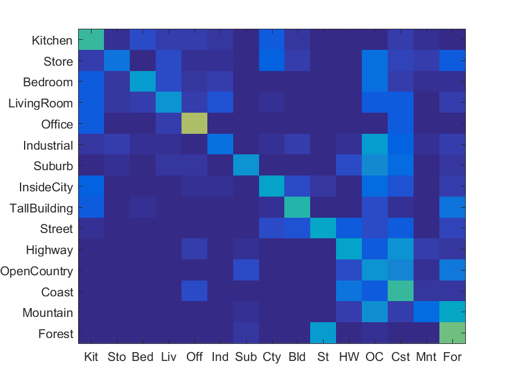
  
- Bag of word(SIFT and Fisher vector and Gaussian pyramid L=3) (voc size = 400)
  - Accuracy = 0.734
  
  
- Bag of word(SIFT and Gaussian pyramid L=3) + Linear SVM (voc size = 100)
  - Accuracy = 0.758
  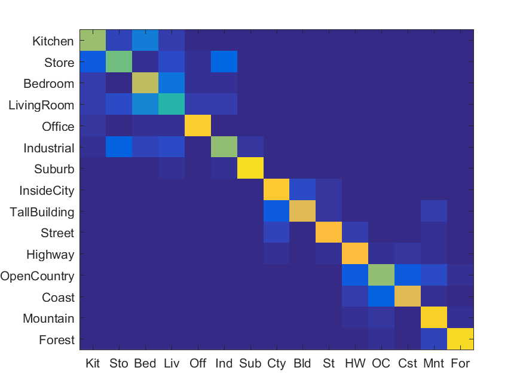
  
- Bag of word(SIFT and Gaussian pyramid L=3) + Linear SVM (voc size = 200)
  - Accuracy = 0.781
  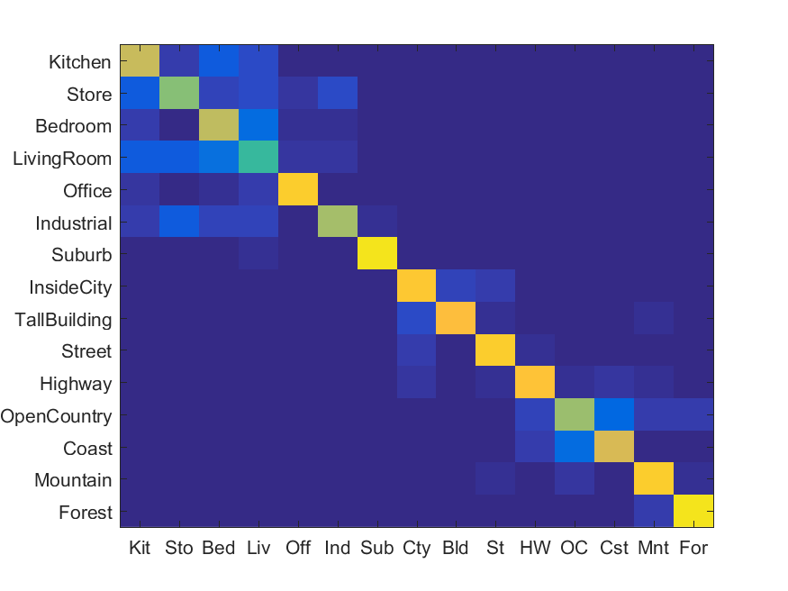
  
- Bag of word(SIFT and Gaussian pyramid L=3) + Linear SVM (voc size = 800)
  - Accuracy = 0.793
  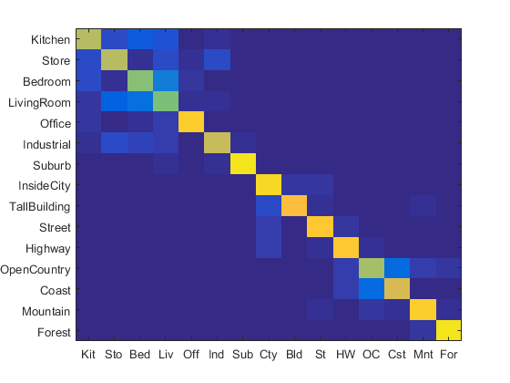
  
- Bag of word(SIFT and Gaussian pyramid L=3) + Linear SVM (voc size = 1600)
    - Accuracy = 0.758
   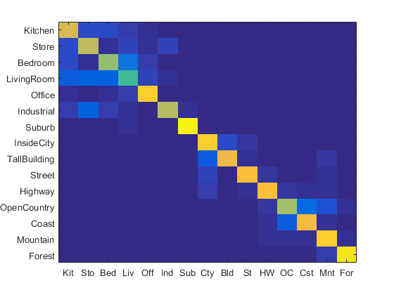
   
- Bag of word(SIFT and Gaussian pyramid L=3) + Linear SVM (voc size = 3200)
  - Accuracy = 0.774
   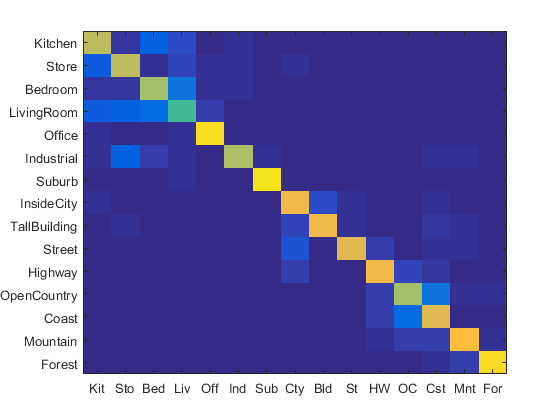
